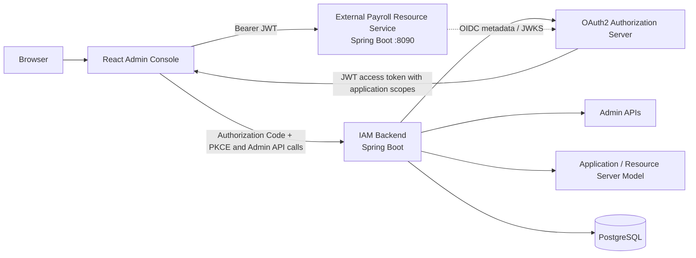
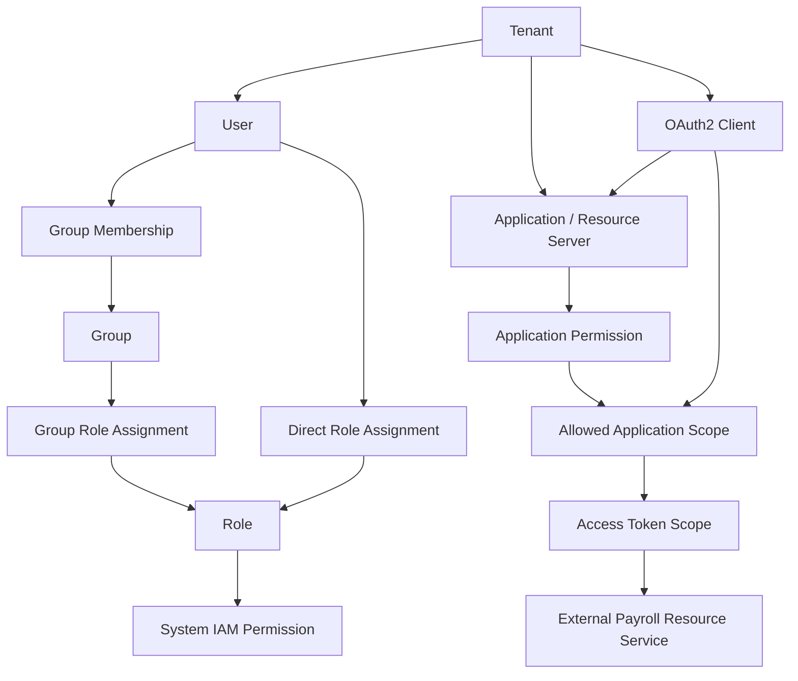

# IdentityForge

IdentityForge is a portfolio-grade Identity and Access Management platform.
It demonstrates tenant-aware identity administration, role-based access control
(RBAC), OAuth2 Authorization Code + PKCE, application scopes, consent
management, token lifecycle foundations, audit logging, and scope-protected
resource API access. It also demonstrates OIDC ID Tokens and a scope-aware
UserInfo endpoint for tenant-owned user identity claims.

This is a public portfolio project created to demonstrate modern Java backend
engineering, identity security, system design, React integration, Docker,
CI/CD, testing, and English technical documentation. It is an independent
project and is not copied from, or presented as, any company product.

The repository is intended for engineers, reviewers, and interviewers who want
to inspect a practical IAM/OAuth2 implementation and run a complete local demo.
It is **not production-ready**, is not intended to replace a production IAM
platform, and requires production hardening before use with real users or
business data.

## Reviewer Quick Start

Choose the review depth that fits your time:

| Time | Review path | Best starting point |
| --- | --- | --- |
| 5 minutes | Understand the product boundaries and strongest proof without running it | [Portfolio Review Guide](docs/demos/portfolio-review.md#five-minute-review-without-running-the-project) |
| 15 minutes | Run the narrated Admin Console and least-privilege Payroll demo | [Fifteen-Minute Walkthrough](docs/demos/portfolio-review.md#fifteen-minute-narrated-walkthrough) |
| 30 minutes | Inspect module ownership, security decisions, and protocol limits | [Documentation Map](docs/README.md) |
| Code review | Trace enforcement from token claims to backend policy and a separate resource service | [Architecture Foundation](docs/architecture/README.md) |

The clearest end-to-end proof is intentionally narrow: request only
`payroll.employee.read`, receive `200` from the employee endpoint, and receive
`403` from the salary endpoint with the same otherwise-valid token. That result
connects persisted client configuration, user authorization, JWT issuance,
audience binding, and independent resource-server scope enforcement.

### Evidence at a Glance

| Capability | Implemented evidence | Explicit boundary |
| --- | --- | --- |
| Tenant IAM and RBAC | Tenant-qualified identities, direct/group roles, effective permissions, concrete Admin API permission checks | Additive RBAC, not a general policy engine |
| OAuth2 and OIDC | Persisted clients, Authorization Code, PKCE, consent, ID Tokens, scope-aware UserInfo | No pairwise subjects or advanced claim mapping |
| MFA | Encrypted TOTP, QR enrollment, login challenge, replay prevention, one-time recovery codes | Process-local throttling; no separate recent-auth step-up ceremony |
| SCIM 2.0 | Users, groups, direct membership, bounded filters/PATCH, ETags, errors, discovery | Documented supported subset, not full conformance |
| Token lifecycle | JDBC grants/consents, refresh rotation, replay detection, revocation, security-state invalidation | Single-deployment state; no distributed denylist or event propagation |
| External authorization | Separate Payroll process verifies signature, issuer, time, `payroll-api` audience, and endpoint scope | Static demo data; no business persistence |

Any portfolio screenshots should be captured from the running application—not
mocked—using the security-safe [Screenshot Capture Guide](docs/demos/screenshots.md).
The guide defines the canonical visual sequence, filenames, captions, and
secret-exclusion rules.

## Why This Project Exists

IAM systems connect authentication, authorization, identity data, security
boundaries, API design, and operational concerns. This project provides a
concrete workspace for demonstrating those concerns as integrated product
slices rather than isolated framework examples.

The main local demo proves a complete application-scope flow:

1. A tenant owns a Payroll API application.
2. The application defines permissions such as `payroll.employee.read`.
3. An OAuth2 client is allowed to request selected application permissions as
   scopes.
4. Spring Authorization Server issues an access token after user authorization.
5. An independently running Payroll resource service validates the JWT and
   allows or rejects requests based on issuer, audience, and scopes.

## Visual Demo Narrative

The recommended portfolio story is:

1. **Tenant context** — select Development Tenant and show that directory,
   access, application, protocol, and audit views share the boundary.
2. **Effective authorization** — trace a user from direct/group role assignment
   to de-duplicated effective permissions enforced by the backend.
3. **Application scope model** — show Payroll permissions separately from
   system IAM permissions and OIDC identity scopes.
4. **Authorization journey** — generate a registered OAuth2 request, complete
   backend-owned login/MFA/consent as configured, and exchange the code.
5. **Least-privilege proof** — use one token to produce employee `200` and
   salary `403` from the independent Payroll service.
6. **Provisioning and evidence** — generate a supported SCIM request, observe
   the shared directory, and finish in tenant-scoped audit logs.

See the [Portfolio Review Guide](docs/demos/portfolio-review.md) for narration,
exact setup, optional mutation steps, and truthful production boundaries.

## Feature Overview

### Identity Administration

- Tenant-aware users, profiles, custom attributes, password credentials, and
  account status.
- Group membership and user lifecycle administration.
- A documented SCIM 2.0 supported subset for user, group, and direct-membership
  provisioning, including filtering, pagination, PATCH, ETags, and SCIM errors.

### Tenant and Admin Authorization

- Platform operator authority stored outside tenant RBAC, with tenant-scoped
  `tenant-admin` and `auditor` role templates.
- Backend-enforced Admin RBAC for `/api/**`.
- Fine-grained Admin API permission checks in addition to OAuth2 scope checks.

### RBAC and Effective Permissions

- Tenant-scoped roles backed by a global system IAM permission catalog.
- Direct user roles and group-derived roles.
- De-duplicated effective roles and effective permissions exposed to the
  authenticated user and Admin Console.

### OAuth2 / Authorization Server

- Spring Authorization Server integration with persisted OAuth2 clients.
- OAuth2 Authorization Code flow, including PKCE for the public Admin Console
  client.
- Backend-owned login, optional TOTP challenge, and consent pages.
- Audience-bound JWT access tokens, durable development signing keys, and
  scope validation.
- OIDC ID Tokens with stable user-ID subjects and safe basic identity claims.
- OIDC UserInfo endpoint at `/userinfo` with claims filtered by granted scopes.

### OIDC Identity Claims

OIDC identity scopes are separate from application authorization scopes and
Admin API permissions:

| Scope | UserInfo claims |
| --- | --- |
| `openid` | `sub` |
| `profile` | `preferred_username`, `name`, `display_name`, `tenant_id`, `tenant_name`, `account_status` |
| `email` | `email`, `email_verified` |
| `groups` | `groups` |
| `roles` | `roles`, `effective_roles` |

`groups` and `roles` are explicit custom scopes. ID Tokens contain `sub` plus
small basic identity context, add account status for `profile`, and add email
claims for `email`. They do not contain groups, roles, effective permissions,
credential data, secrets, or tokens. `sub` is the stable user ID as a string;
pairwise subject identifiers and advanced claim mapping remain future work.

### Applications and Resource Servers

- Tenant-owned Applications / Resource Servers.
- Application permissions modeled separately from system IAM permissions.
- OAuth2 clients linked to applications with selected application permissions
  allowed as requestable scopes.

### External Demo Resource Service

- A separate Spring Boot service under `payroll-resource-service/`, listening
  on port 8090 with no shared IdentityForge domain code, database, session, or
  process-memory dependency; its runtime trust is issuer metadata and JWKS.
- Independent signature, issuer, expiration, `payroll-api` audience, and
  endpoint-scope validation.
- A complete local demonstration of `401`, `403`, and successful resource
  access for `payroll.employee.read`, `payroll.salary.read`, and
  `payroll.salary.write`.

### Token Lifecycle and Consents

- JDBC-backed authorization state with bounded refresh-token rotation and
  hashed replay detection for
  supported confidential authorization-code clients.
- OAuth2 token revocation endpoint at `/oauth2/revoke`; revocation and consent
  removal invalidate the complete local authorization family.
- Safe consent listing and revocation for current users and administrators.
- JDBC-backed consent storage.
- Ten-minute access tokens, security-state invalidation, and hourly expired
  authorization cleanup. See
  [session and token hardening](docs/security/session-and-token-hardening.md).

### Security and Audit

- TOTP MFA enrollment with encrypted secrets, standards-compatible QR setup,
  login challenges, replay prevention, and attempt throttling.
- Ten high-entropy recovery codes issued after factor verification, stored only
  as keyed digests, shown once, consumed atomically, and replaceable as a set.
- Audit events for identity administration, authentication, consent, token
  lifecycle, and other security-sensitive actions.
- Bounded browser sessions, session-fixation protection, POST+CSRF logout,
  CSRF-protected consent, and stateless bearer-only Admin/SCIM API boundaries.
- Safe DTOs and one-time secret display rules that avoid exposing password
  hashes, TOTP ciphertext, client secret hashes, authorization codes, or tokens.

### Admin Console

- React TypeScript Admin Console using real backend Admin APIs.
- OAuth2 Authorization Code + PKCE login.
- Responsive, task-grouped navigation with persistent tenant context and
  explicit loading, empty, validation, error/retry, and destructive-action
  states.
- Pages for tenants, users, groups, roles, permissions, applications, OAuth2
  clients, consents, MFA actions, audit logs, and guided IAM, OAuth2/OIDC, and
  SCIM demo workflows.

### Engineering Practices

- Java 21, Spring Boot 3.5.x, PostgreSQL, Flyway, and Docker Compose.
- Clean pre-release Flyway V1 schema.
- Spring Modulith boundary verification and Testcontainers-backed integration
  tests.
- Maven Wrapper, frontend build verification, Docker image build, and GitLab
  CI/CD pipeline.
- OpenAPI documentation and centralized API validation/error handling.

## Architecture Overview





System IAM permissions protect this platform's Admin APIs. Application
permissions describe capabilities exposed by tenant-owned applications and can
be issued as OAuth2 scopes. They are intentionally separate authorization
models. OIDC scopes control identity claims and do not grant application or
Admin API access.

The backend is a capability-oriented modular monolith. Its top-level modules
own shared infrastructure, directory and access control, authentication,
applications, OAuth/OIDC, provisioning, audit, and bootstrap behavior. See
[Architecture Foundation](docs/architecture/README.md) for module ownership
and the durable decisions behind the current foundation.

## Quick Start

### Prerequisites

- JDK 21
- Docker or a Docker-compatible container runtime
- Node.js 20+ and npm
- Git

### Start Local Dependencies

From the repository root:

```bash
docker compose up -d
```

This starts PostgreSQL on `localhost:5432`. Compose credentials are local
development values only.

### Start the Backend

```bash
./mvnw spring-boot:run -Dspring-boot.run.profiles=dev
```

The backend starts at `http://localhost:8080`.

```bash
curl http://localhost:8080/api/health
```

Outside the `dev` profile, startup requires `IAM_DB_URL`, `IAM_DB_USERNAME`,
`IAM_DB_PASSWORD`, `IAM_ALLOWED_ORIGINS`, `IAM_OAUTH_ISSUER`,
`IAM_SECRET_ENCRYPTION_KEY`, `IAM_SIGNING_KEY_FILE`, and
`IAM_ADMIN_CONSOLE_URL`. Set `IAM_COOKIE_SECURE=false` only for an HTTP-only
local environment; secure cookies are the default.

### Start the Admin Console

In a second terminal:

```bash
cd frontend
npm install
npm run dev
```

Open `http://localhost:5173`, select **Continue to sign in**, and
log in with:

```text
username: development/admin
password: admin123456
```

These credentials are created only by the `dev` profile and must never be used
in a production environment.

The frontend defaults to `http://localhost:8080` for backend calls. Set
`VITE_API_BASE_URL` when a different local backend URL is required. Its OAuth2
Demo commands default to `http://localhost:8090` for Payroll; override that
with `VITE_PAYROLL_API_BASE_URL`.

### Start the External Payroll Resource Service

After IdentityForge is running, start the independent resource server in a
third terminal:

```bash
./mvnw -f payroll-resource-service/pom.xml spring-boot:run
```

It starts at `http://localhost:8090`; only `/api/health` is public. See the
[external Payroll demo guide](docs/demos/external-payroll-resource-service.md)
for signed-token commands, expected `200`/`202`/`401`/`403` outcomes, Docker,
configuration, and tests.

## Dev Bootstrap Data

The `dev` profile creates local-only data for the main portfolio demo:

| Type | Value |
| --- | --- |
| Tenant | `Development Tenant` |
| Tenant realm | `development` |
| Platform operator | `development/admin` / `admin123456` |
| Public Admin Console client | `identityforge-console` |
| Demo OAuth2 client | `IdentityForge Dev Client` |
| Demo OAuth2 client ID / secret | `identityforge-dev` / `secret` |
| Application / Resource Server | `Payroll API` |
| Application permissions | `payroll.employee.read`, `payroll.salary.read`, `payroll.salary.write` |

## Recommended End-to-End Demo

After completing [Quick Start](#quick-start), use this short proof path:

1. Select **Development Tenant** on the Dashboard.
2. Open **Applications** and show the Payroll API permissions.
3. Open **OAuth2 Clients** and show that **IdentityForge Dev Client** is linked
   to Payroll API and may request selected application scopes.
4. Open **OAuth2 & OIDC**, select the development client, set the registered
   redirect URI to `http://127.0.0.1:8080/oauth2/demo/callback`, and request
   only `payroll.employee.read` as an application scope.
5. Complete the real backend authorization flow and run the generated code
   exchange command locally.
6. Use the returned token against both Payroll endpoints:

   ```bash
   curl -i -H "Authorization: Bearer <ACCESS_TOKEN>" \
     http://localhost:8090/api/payroll/employees

   curl -i -H "Authorization: Bearer <ACCESS_TOKEN>" \
     http://localhost:8090/api/payroll/salaries
   ```

Expected result: employees returns `200`; salaries returns `403` because
`payroll.employee.read` does not imply `payroll.salary.read`.

The bootstrap development client does **not** require consent by default. Enable
**Require consent** or create a consent-required Web App client when the consent
screen is part of the demonstration. Never place the access token,
authorization code, client secret, or browser storage in screenshots.

The complete narrated path—including effective RBAC, MFA, SCIM, audit evidence,
and optional mutations—is in the
[Portfolio Review Guide](docs/demos/portfolio-review.md). A shorter
client-credentials resource-service proof is in the
[Payroll demo guide](docs/demos/external-payroll-resource-service.md).

## Admin Console Workflows

The Admin Console supports the core IAM relationships without requiring normal
UUID copy/paste:

- Select a tenant once and use it across tenant-scoped screens.
- Create and manage users, profiles, attributes, groups, roles, applications,
  and OAuth2 clients.
- Assign roles directly to users or indirectly through groups.
- Attach global system IAM permissions to tenant roles.
- Review direct, group-derived, and effective roles and permissions.
- Define application permissions and allow selected permissions as OAuth2
  client scopes.
- Manage personal TOTP setup and recovery codes, review or disable user MFA,
  manage OAuth2 consents, and review audit logs.
- Use **IAM Workflow**, **OAuth2 & OIDC**, and **SCIM Provisioning** as guided
  portfolio demonstrations with validation, generated commands, and links to
  directory and audit evidence.

## What This Project Demonstrates

For code review and interview discussion, the repository demonstrates:

- Spring Authorization Server integration with persisted client registration.
- OAuth2 Authorization Code + PKCE for a public React client.
- Token scopes generated from tenant-owned application permissions.
- Scope-aware OIDC ID Token and UserInfo identity claims.
- Scope-protected resource API behavior, including expected `200` and `403`
  outcomes.
- External resource-server validation of IdentityForge JWT signatures, issuer,
  audience, expiration, and application scopes.
- Tenant-aware RBAC and effective authorization from direct and group-derived
  roles.
- Fine-grained backend authorization for Admin API operations.
- Safe DTO boundaries, client secret handling, and avoidance of credential
  material in normal API responses.
- Audit trail design for identity, authentication, consent, and token events.
- A bounded, discoverable SCIM 2.0 protocol adapter over the same tenant-aware
  directory and audit use cases used by the Admin Console.
- Testcontainers integration tests, Docker-based local development, and CI/CD
  practice.

## Security Notes

- `/api/health` is public.
- Admin APIs under `/api/**` require OAuth2 JWT scopes and backend Admin RBAC.
  Scopes are necessary but not sufficient for administrative access.
- SCIM APIs under `/scim/v2/{tenantId}/**` require an admin audience,
  scopes, concrete permissions, and the matching tenant boundary.
- The implemented SCIM subset, examples, error mappings, and explicit non-goals
  are documented in [SCIM 2.0 Supported Subset](docs/protocols/scim.md).
- The Payroll service trusts only the configured IdentityForge issuer/JWKS and
  `payroll-api` audience; a valid admin-audience token is still rejected.
- Interactive login identifiers use `realm/username`; tenant-local duplicate
  usernames are resolved only through the explicit realm.
- Tenant roles cannot confer platform authority. Platform operator grants are
  stored and administered through a separate trust boundary.
- The React Admin Console uses the persisted public `identityforge-console` client
  with Authorization Code + PKCE.
- Browser login, MFA challenge, and consent are backend-owned at `/login`,
  `/login/mfa`, and `/oauth2/consent`.
- Confidential client secrets are shown only on creation or rotation.
- TOTP setup secrets and `otpauth://` URIs are shown only during enrollment.
- Recovery-code plaintext is returned only after initial TOTP verification or
  explicit regeneration. Status and audit APIs expose counts/events only.
- TOTP enrollment and recovery-code generation are self-service boundaries;
  administrators may inspect status and disable a factor without receiving its
  credential material.
- The default admin credentials, demo client secret, signing configuration,
  Compose credentials, and browser token storage model are for local
  development only.

After startup:

- Swagger UI: `http://localhost:8080/swagger-ui/index.html`
- OpenAPI JSON: `http://localhost:8080/v3/api-docs`

## Current Limitations

This project is a portfolio-grade prototype, not a production-ready IAM
platform.

- Authorization grants and consents are JDBC-backed, while browser sessions
  and some immediate security controls remain node-local; there is no
  distributed session, denylist, or event-propagation layer.
- The external Payroll service contains static demo data, has no persistence,
  and is not a real payroll system.
- MFA throttling is process-local, and enrollment/recovery-code regeneration
  rely on the short-lived Admin Console access token rather than a separate
  step-up ceremony. Distributed throttling and explicit step-up are production
  hardening work.
- Pairwise OIDC subject identifiers and advanced claim transformation remain
  future work.
- SCIM is a documented supported subset rather than full protocol conformance;
  schemas/resource types, bulk, sorting, nested groups, extensions, attribute
  projection, POST search, and the complete filter grammar remain out of scope.
- The frontend is a portfolio-polished demonstration console, not a production
  operations UI with full localization, accessibility certification, or
  large-directory virtualization.
- Managed key rotation, distributed session/token infrastructure, rate limiting,
  observability, high availability, and operational hardening remain future
  work.

## Development Commands

Run backend tests. Docker is required for Testcontainers:

```bash
./mvnw test
```

Run the external resource-service signed-JWT integration tests:

```bash
./mvnw -f payroll-resource-service/pom.xml test
```

Run the frontend component/demo-flow tests, QR encoder tests, and production build:

```bash
cd frontend
npm test
npm run build
```

Stop local dependencies:

```bash
docker compose down
```

Reset local database volumes when a clean development environment is required:

```bash
./scripts/reset-local-db.sh
```

The current pre-release migration policy is a squashed clean `V1` baseline.
Existing local databases from an older revision must be reset; no retained
production data migration path is implied.

## Roadmap

Planning and production-hardening priorities are tracked in
[docs/ROADMAP.md](docs/ROADMAP.md).

## Tech Stack

- Java 21
- Spring Boot 3.5.x
- Spring Security and Spring Authorization Server
- Spring Data JPA and Flyway
- PostgreSQL
- Spring Modulith
- React, TypeScript, and Vite
- Docker Compose
- Testcontainers
- OpenAPI / Swagger UI
- Maven Wrapper
- GitLab CI/CD
