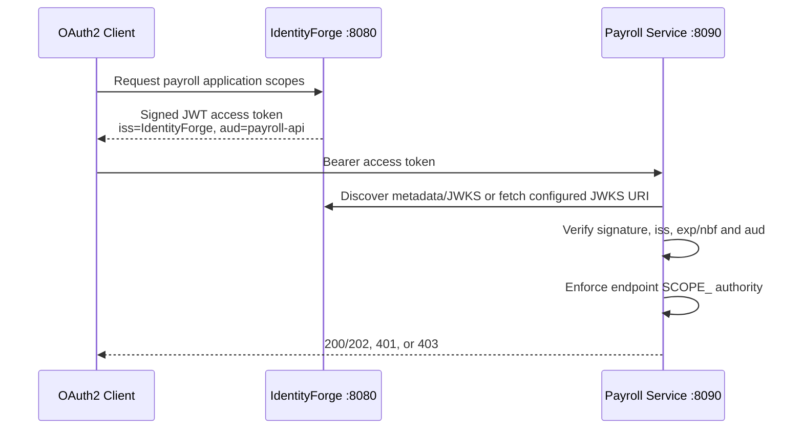

# External Payroll Resource Service Demo

The demo Payroll API is an independently runnable Spring Boot OAuth2 resource
server in `payroll-resource-service/`. It has no database dependency and does
not share code, process memory, sessions, or a JWT decoder with IdentityForge.
Its only trust relationship is the configured IdentityForge issuer and public
signing keys.

This is intentionally static demo data. The slice demonstrates token issuance
and enforcement across a real service boundary, not a payroll product.

For the reviewer-oriented narrative that connects this service to tenant IAM,
OIDC, MFA, SCIM, and audit evidence, use the
[Portfolio Review Guide](portfolio-review.md).

## Architecture



IdentityForge links the development OAuth2 client to the `payroll-api`
application. Its access tokens therefore receive `aud: ["payroll-api"]`, and
only assigned application permissions can be requested as scopes. The Payroll
service independently requires that audience and then applies least-privilege
scope checks:

| Operation | Required scope | Success |
| --- | --- | --- |
| `GET /api/payroll/employees` | `payroll.employee.read` | `200` |
| `GET /api/payroll/salaries` | `payroll.salary.read` | `200` |
| `POST /api/payroll/salaries` | `payroll.salary.write` | `202` |
| `GET /api/health` | Public | `200` |

An absent or invalid bearer token returns `401`. A valid Payroll token without
the operation's scope returns `403`. Admin permissions and OIDC scopes do not
authorize Payroll operations.

## Local Run

Prerequisites are Java 21, Docker for PostgreSQL, and optionally `jq` for the
short token commands.

1. Start PostgreSQL and IdentityForge:

   ```bash
   docker compose up -d postgres
   ./mvnw spring-boot:run -Dspring-boot.run.profiles=dev
   ```

2. In another terminal, start the external resource service:

   ```bash
   ./mvnw -f payroll-resource-service/pom.xml spring-boot:run
   ```

   It listens on `http://localhost:8090`. IdentityForge must be available first
   because the resource server discovers its metadata and signing keys.

3. Request a token with only employee-read access:

   ```bash
   ACCESS_TOKEN=$(curl -s -u 'identityforge-dev:secret' \
     -X POST 'http://localhost:8080/oauth2/token' \
     -H 'Content-Type: application/x-www-form-urlencoded' \
     -d 'grant_type=client_credentials' \
     -d 'scope=payroll.employee.read' | jq -r '.access_token')
   ```

4. Demonstrate allowed and denied access with the same token:

   ```bash
   curl -i -H "Authorization: Bearer $ACCESS_TOKEN" \
     http://localhost:8090/api/payroll/employees

   curl -i -H "Authorization: Bearer $ACCESS_TOKEN" \
     http://localhost:8090/api/payroll/salaries
   ```

   The first response is `200`; the second is `403` because employee read does
   not imply salary read.

5. Request salary scopes and exercise independent read/write permissions:

   ```bash
   SALARY_READ_TOKEN=$(curl -s -u 'identityforge-dev:secret' \
     -X POST 'http://localhost:8080/oauth2/token' \
     -H 'Content-Type: application/x-www-form-urlencoded' \
     -d 'grant_type=client_credentials' \
     -d 'scope=payroll.salary.read' | jq -r '.access_token')

   curl -i -H "Authorization: Bearer $SALARY_READ_TOKEN" \
     http://localhost:8090/api/payroll/salaries

   curl -i -X POST -H "Authorization: Bearer $SALARY_READ_TOKEN" \
     http://localhost:8090/api/payroll/salaries
   ```

   Salary read returns `200`; salary write returns `403` until a token includes
   `payroll.salary.write`.

The Admin Console OAuth2 Demo page also generates commands for port 8090 after
an authorization-code flow. Set `VITE_PAYROLL_API_BASE_URL` if the service is
hosted elsewhere.

## Container Run

Build the service and start its Compose profile after IdentityForge is running
on the host:

```bash
./mvnw -f payroll-resource-service/pom.xml package
docker compose --profile payroll-demo up --build payroll-resource-service
```

Compose preserves the public issuer value `http://localhost:8080` while using
`host.docker.internal` only as the internal JWKS transport address. This split
is important: `iss` validation compares the token's public issuer exactly;
network routing must not redefine issuer identity.

## Configuration

| Environment variable | Default | Meaning |
| --- | --- | --- |
| `PAYROLL_SERVER_PORT` | `8090` | Resource-service HTTP port |
| `IDENTITYFORGE_ISSUER` | `http://localhost:8080` | Exact trusted `iss` value |
| `IDENTITYFORGE_JWK_SET_URI` | empty | Optional direct JWKS transport URI; empty uses issuer discovery |
| `PAYROLL_API_AUDIENCE` | `payroll-api` | Required access-token audience |

Production configuration should use HTTPS, private network controls,
operational timeouts/monitoring, and managed signing-key rotation. This demo
does not implement token introspection or immediate revocation; it validates
self-contained JWTs until their short expiration. The API is stateless and
does not authenticate with cookies, so it disables sessions, request caching,
and CSRF processing; introducing cookie authentication would require revisiting
that CSRF decision.

## Automated Verification

Run:

```bash
./mvnw -f payroll-resource-service/pom.xml test
```

The integration suite loads the complete Spring Security filter chain and
sends real RS256-signed JWT strings through MockMvc. It covers public health,
missing tokens, allowed employee/salary operations, insufficient scopes, wrong
audience, wrong issuer, expiration, and an untrusted signature. A test-only
decoder trusts the generated public key so the suite is deterministic and
requires no running IdentityForge or network socket; production uses issuer
discovery or the configured JWKS URI.

## Protocol References

- [Spring Security JWT Resource Server](https://docs.spring.io/spring-security/reference/servlet/oauth2/resource-server/jwt.html)
- [RFC 6750: OAuth 2.0 Bearer Token Usage](https://www.rfc-editor.org/rfc/rfc6750.html)
- [RFC 9068: JWT Profile for OAuth 2.0 Access Tokens](https://www.rfc-editor.org/rfc/rfc9068.html)

The demo applies the relevant bearer-token, signature, issuer, time, audience,
and scope validation rules; it does not claim to implement every optional part
of the RFC 9068 profile.
